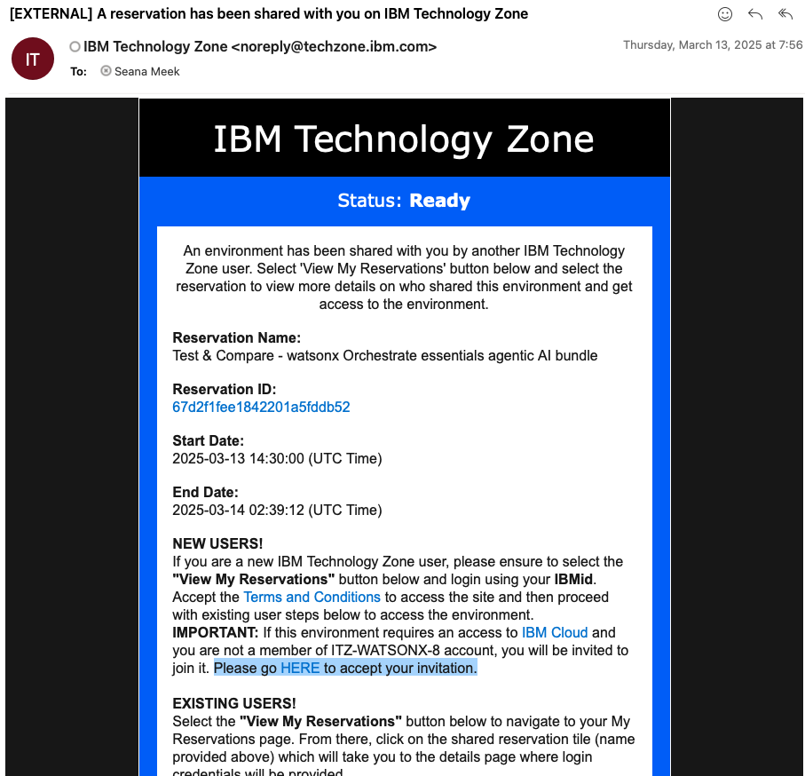
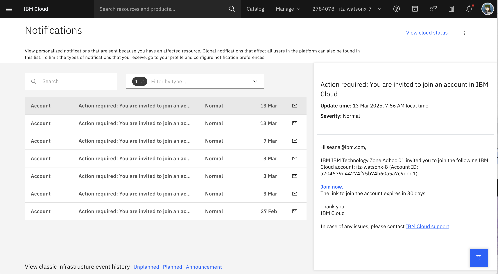

# Access Class Environment

**Note:** Follow these instructions for accessing your instance of the class environment in order to successfully complete the Agentic AI Bootcamp. 

When you are invited to the class environment, you'll receive an email. This message is from IBM Technology Zone <noreply@techzone.ibm.com> inviting you to join the account where your class environment is located.

In the email, look for the link in the sentence **"Please go HERE to accept your invitation."** (Highlighted in the screenshot below.)

**Option:** If you miss the email or don't receive it for any reason! 

You can find the invitation on your IBM Cloud account:
[https://cloud.ibm.com/notifications?type=account](https://cloud.ibm.com/notifications?type=account)

Please select the **Join Now** link. 

