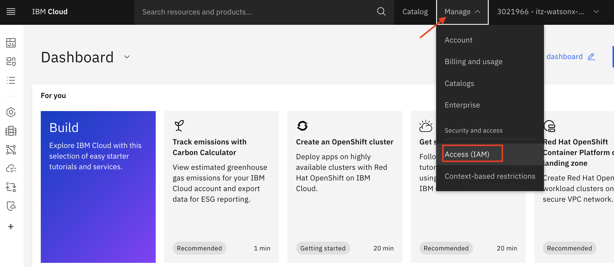
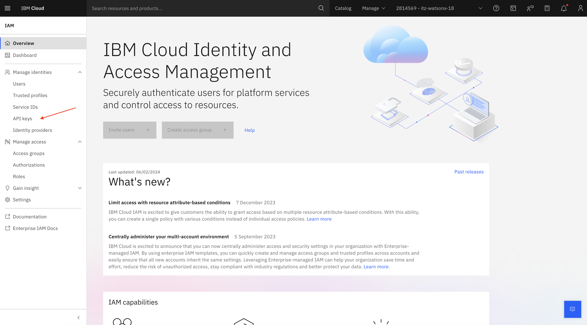
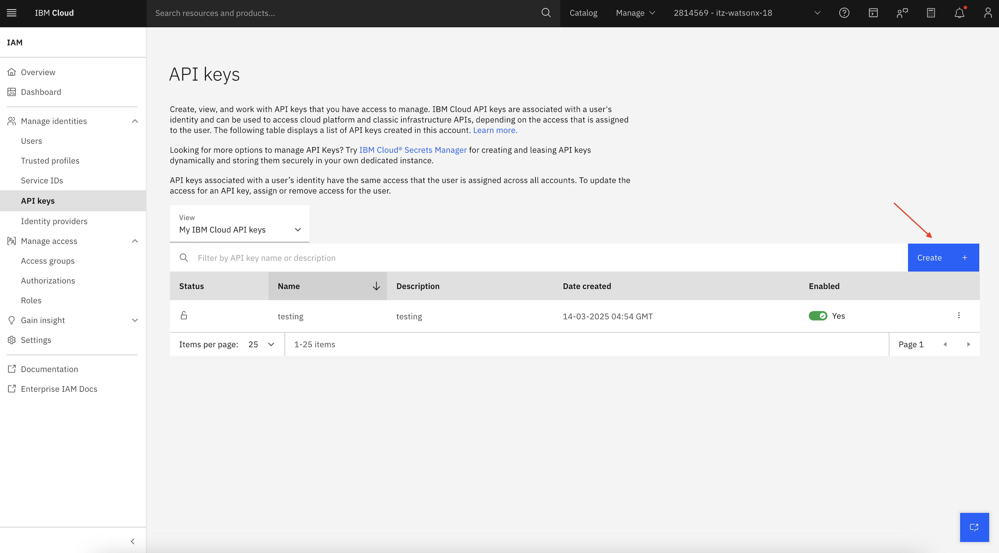
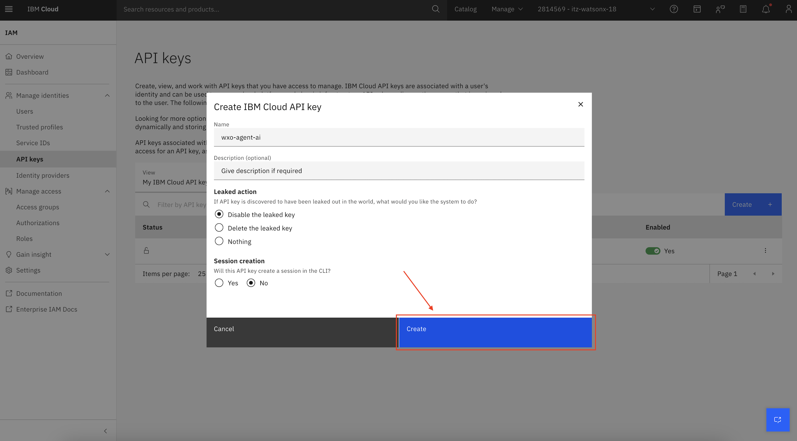
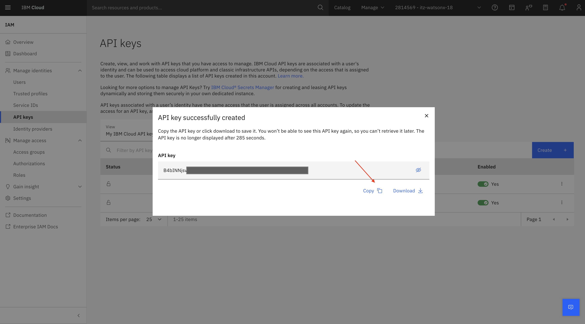

# Creating a Cloud API Key
1. Navigate to [IBM Cloud](cloud.ibm.com). Click on **Manage** -> **Access(IAM)**

   

1. On next screen, select **API Keys** from menu.

   

1. Click on **Create**.

   

1. Give your API key a name, then click on **Create**.

   

1. Copy your API key and save it in a secure location. You will need it in later steps.  

      

